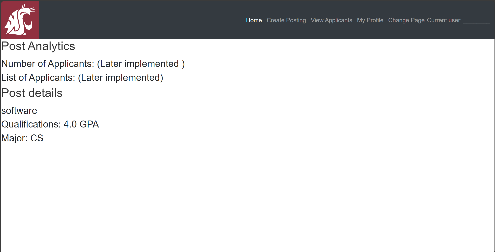

# Design Document

## Your Project Title
--------
Prepared by:

* `<Kyan Kotschevar-Smead>`,`<TeamGit>`
* `<Elliot Perez>`,`<TeamGit>`
* `<Fredy Fernandez>`,`<TeamGit>`
---

**Course** : CptS 322 - Software Engineering Principles I

**Instructor**: Sakire Arslan Ay

---

## Table of Contents
- [Design Document](#design-document)
  - [Your Project Title](#your-project-title)
  - [Table of Contents](#table-of-contents)
    - [Document Revision History](#document-revision-history)
- [1. Introduction](#1-introduction)
- [2.	Architectural and Component-level Design](#2architectural-and-component-level-design)
  - [2.1 System Structure](#21-system-structure)
  - [2.2 Subsystem Design](#22-subsystem-design)
    - [2.2.1 Model](#221-model)
    - [2.2.2 Controller](#222-controller)
    - [2.2.3 View and User Interface Design](#223-view-and-user-interface-design)
- [3. Progress Report](#3-progress-report)
- [4. Testing Plan](#4-testing-plan)
- [5. References](#5-references)
- [Appendix: Grading Rubric](#appendix-grading-rubric)

### Document Revision History

| Name | Date | Changes | Version |
| ------ | ------ | --------- | --------- |
|Revision 1 |2021-10-05 |Initial draft | 1.0        |
|      |      |         |         |
|      |      |         |         |

# 1. Introduction

Explain the purpose for providing this design document. If this is a revision of an earlier document, please make sure to summarize what changes have been made during the revision (keep this discussion brief). 

Then provide a brief description of your project and state your project goal.

At the end of the introduction, provide an overview of the document outline.

[Section II](#2-architectural-and-component-level-design) includes …

[Section III](#22-subsystem-design) includes …

# 2.	Architectural and Component-level Design
## 2.1 System Structure

 
 
 We adopted the MVC pattern for our architecture. Our model is responsible for data retrieval, manipulation, and processing and works closly with the controller. The View is responsible for presenting the data to the user and handling the user interface elements. It is responsible for the visual and interactive parts. The controller is the middle man in between the two, where it handles user action logic and communicates with the Model to create, retrieve, update, or destroy the data accordingly.

By abstracting out system in 3 compoents we designate responsibilies. This when we for say want to change a visual element in the view, it wont effect how the Model and Controller functions. Thus reducing coupling. As for reuse posts Models are used in many controllers and usecases can be reused in simalar cases

## 2.2 Subsystem Design 

(**Note1**: This is just a suggested template. If you adopted a pattern other than MVC, you should revise this template and the list the major subsystems in your architectural design.)

(**Note2**: You should describe the design for the end product (completed application) - not only your iteration1 version. You will revise this document in iteration-2 and make changes  and/or add more details in iteration-2.)

### 2.2.1 Model

Briefly explain the role of the model. 

(***in iteration-1***) Include a list of the tables (models) in your database and explain the role of each table. Provide the attributes of the tables (including relationships).

| ResearchPost                  |
|-------------------------|
|ResearchPost is the table for each research post position |
| - id: int   - title: string   - description: string   - qualifications: string   - major: string   - timestamp: datetime   +/- applications: relationship |
||

| Apply                  |
|-------------------------|
|Apply is the table that holds the data of the application for the researchpost. |
| - id: int   - research_topic: string   - statement: string   - faculty_name: string   - faculty_email: string   +/- researchpost_id: int  |
||

(***in iteration -2***) Revise the database model. Provide a UML diagram of your database model showing the associations and relationships among tables. Your UML diagram should also show the methods of your models.

### 2.2.2 Controller

Your first subsystem is the "User Accounts Manager." This subsystem handles user authentication operations, allowing users to log in and register. Users can choose between student and faculty accounts during this process.

Additionally, there are two other subsystems: the "Faculty Manager" and the "Student Manager." The functionality available to users depends on their account type. Faculty members have access to the faculty UI, where they can create research posts. Students, on the other hand, can access the student UI and apply to research posts.

Both student and faculty users can perform some shared research post operations.

|   | Methods           | URL Path   | Description  |
|:--|:------------------|:-----------|:-------------|
|1. |        index        | /index           |   displays student orfaculty ui homepage       |
|2. |               apply    |    /apply/<int:researchpost_id>        |    Allows students to apply to particular research post          |
|3. |        AddReasearchPost           |     /addReasearch       |      allows faculty to create a researchpost        |
|4. |         seeReasearch          |    /seeReasearch/postid>        |   allows any user to view reasearch post details           |
|5. |    viewStudent      |     /viewStudent/<app>/<student>       |       Allows faculty to see students information       |
|6. |   faculty_reg      |     /faculty_reg       |       allows faculty members to sign up for an account in order to access the application       |
|7. |   student_reg      |     /student_reg       |       allows student members to sign up for an account in order to access the application       |
|8. |    login     |      /login      |       login for is for memebers to login to their accounts in order to access the application       |
|9. |    logout     |      /logout      |       logout is for memebers who are already logged in and want to log out of their accounts.       |
|10. |    viewapplications     |      /applications      |       viewapplications is for students to see all of the pending applications.       |
|10. |    viewapplicants     |      /applicants     |       viewapplicants is for faculty to view all of their applicants anting to apply for the research position.       |

### 2.2.3 View and User Interface Design 

The View is responsible for presenting the data to the user and handling the user interface elements. The way we would like to design our user interface would be with bootstrap styling.  

Provide a list of the page templates you plan to create (or you already created). Briefly describe the information that will be displayed on those pages and the forms that will be rendered (i.e., explain the input and output for each page). Make sure to mention which use-cases in your “Requirements Specification” document will utilize these interfaces for user interaction. You can supplement your description with UI sketches or screenshots. 

#### Faculty & Student Login page
On the faculty & student Login page the user can dedcide to login with either student credentils or faculty creditentials. If the user is an excsitingh user for either fauclty or students then they will be redirected to their home page. If not then they will be denied access. If they're not a member they have the options of registering as a student or faculty. If they chose oone then they will be redirected to the registration page for student or faculty. The use case for this page is #6 and #8.

#### Faculty Register page
On the faculty registration page, it shall display a form that will ask the user to input their first name, last name, email, password, confirm password, and phone number. once the form is validated then the faculty shall be able to be registered in the db and be redirected to the facult home page. The use case for this page #7.

#### Student Register page
On the student registration page, it shal display a form that will ask the user to input their first name, last name, email, password, confirm password, phone number, major, com. GPA, EGD, research interests, programming L., and prior research Experience. Once the form is validated then the student shall be able to be registered in the db and be redirected to the student home page. The use case for this page #5.

#### Faculty home page
On the faculty home page it shall display the research posts of the faculty and have the option to delete the post as will as will the faculty member will have a tab bar where they have the options of either going create posting, View Applicaitions, or Edit Profile. Chosing either options wil redirect the Faculty member to a different page. The use case #3 and #2 are to view a research post on the main faculty home page.

#### Student home page
On the student home page it shall display the research post postions that are available and will have the option od only displaying the research position posts that match you intersts. There will also be a tab bar that the student cas choose of either being at the home page, My Applications, or Edit Profile and each tab will redirect the student to a different page. The use case #3 and #2 are to view a research post on the main student home page.

#### apply page
On the apply page shal display a form where the student can input their research topic, personal statement, faculty name, and faculty email. Once the form is validated then the application will be sent to the corresponding faculty who had the research post. The use case that is in this page is use case #4

#### details page
On the details page it shal display the post analytics which is the number of applicants and list of applicants. The post details shall also be shown here as will.The use case that is in this page is use case #3

#### creating post page
On the creating post page it will display a form toi create a research post that the user will input a title, description, qaulifivations, and research topic. Once the form is validated then the form will be sent to the db. It'll then be displayed on the Home page. The use case that is in this page is use case #1.

#### My profile Page
On the profile page it shall display the users information being their first name, last name, email, password, and phone number. You will also have the option to edit the user information.

#### my applications page
On the my applications page it will display the applications of the student the he/she applied for. It will also give the student the ability to cancel or delete the pending application as will. If the user deletes pending post then on the faculty my applicants page the applicant will no longer display there.The use case that is in this page is use case #12, #11, #9

(***in iteration-1***) Brainstorm with your team members and identify the pages that you think should be created.  If you included most of the major pages, it will be acceptable. 

# 3. Progress Report

Write a short paragraph summarizing your progress in iteration1 / iteration2.

Iteration 1: Iteration 1 went smothly but there were some problems with branches and miscommunication. Even so we made sure to get everyone involved and made sure that everyone wasn't stuck with any problems. We currently have to many templates that can be shorten if we add logins/users to the application but nontheless we managed to give out a running demo.

Iteration 2: Iteration 2 was about both login and register for both Student and Faculty members. When we finished the Loging and register It was now easier for us to now narrow down our templates and routes. After the login and register we then had to asscotiate our posts to our faculty and also to allow the faculty to see the lists of student who applied for the research post and to also view their qualifications.. We now are currently looking forward to the next use cases and the testing for our application.

# 4. Testing Plan

We plan to test our application by doing UI Testing in the browser. We will provide different inputs for our forms and make sure that the things that we want to show up in the UI will work. For example, we want to make sure that is student can log in and be redirected to the student page and we want faculty to login and see the faculty page and what corresponds to each page. Making sure that all buttons work and that all inputs are stored correctly will also be our main focus in testing the application.

# 5. References

Cite your references here.

For the papers you cite give the authors, the title of the article, the journal name, journal volume number, date of publication and inclusive page numbers. Giving only the URL for the journal is not appropriate.

For the websites, give the title, author (if applicable) and the website URL.

CPTS 322 Lecture, Sakire Arslan Ay
CPTS 322 SmileAPP
CPTS 322 StudentAPP
Flask Documentation
HTML/CSS Documentation 

----
# Appendix: Grading Rubric
(Please remove this part in your final submission)

These is the grading rubric that we will use to evaluate your document. 

|**MaxPoints**| **Design** |
|:---------:|:-------------------------------------------------------------------------|
|           | Are all parts of the document in agreement with the product requirements? |
| 10        | Is the architecture of the system described well, with the major components and their interfaces?  Is the rationale for the proposed decomposition in terms of cohesion and coupling explained well? |
| 15        | Is the document making good use of semi-formal notation (i.e., UML diagrams)? Does the document provide a clear and complete UML component diagram illustrating the architecture of the system? |
| 15        | Is the model (i.e., “database model”) explained well with sufficient detail? | 
| 10        | Is the controller explained in sufficient detail?  |
| 22        | Are all major interfaces (i.e., the routes) listed? Are the routes explained in sufficient detail? |
| 10        | Is the view and the user interfaces explained well? Did the team provide the screenshots of the interfaces they built so far.   |
| 5         | Is there sufficient detail in the design to start Iteration 2?   |
| 5         | Progress report  |
|           |   |
|           | **Clarity** |
|           | Is the solution at a fairly consistent and appropriate level of detail? Is the solution clear enough to be turned over to an independent group for implementation and still be understood? |
| 5         | Is the document carefully written, without typos and grammatical errors?  |
| 3         | Is the document well formatted? (Make sure to check your document on GitHub. You will loose points if there are formatting issues in your document.  )  |
|           |  |
|           | **Total** |
|           |  |
